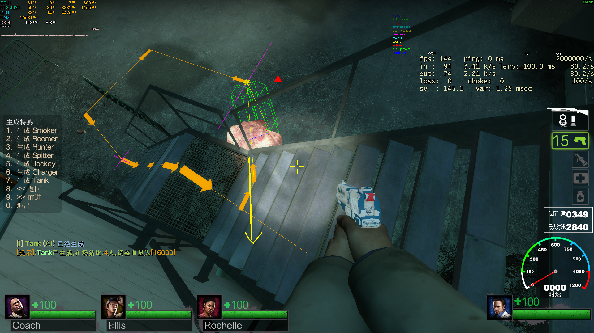
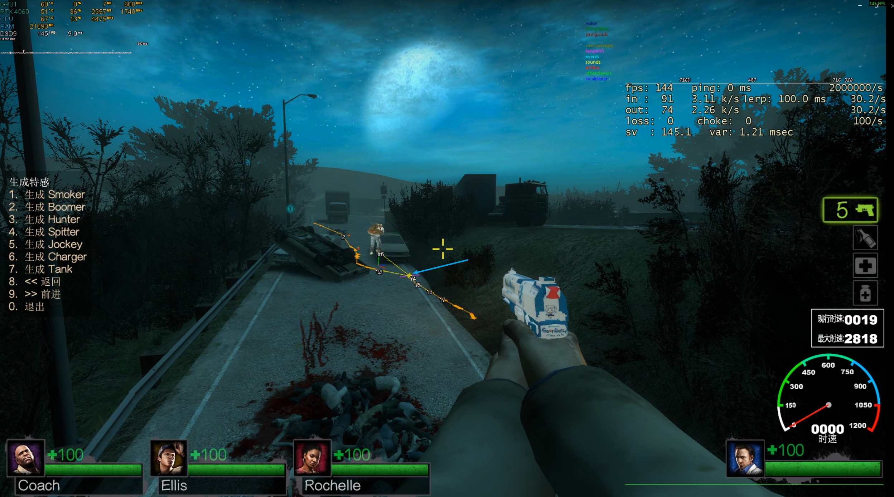
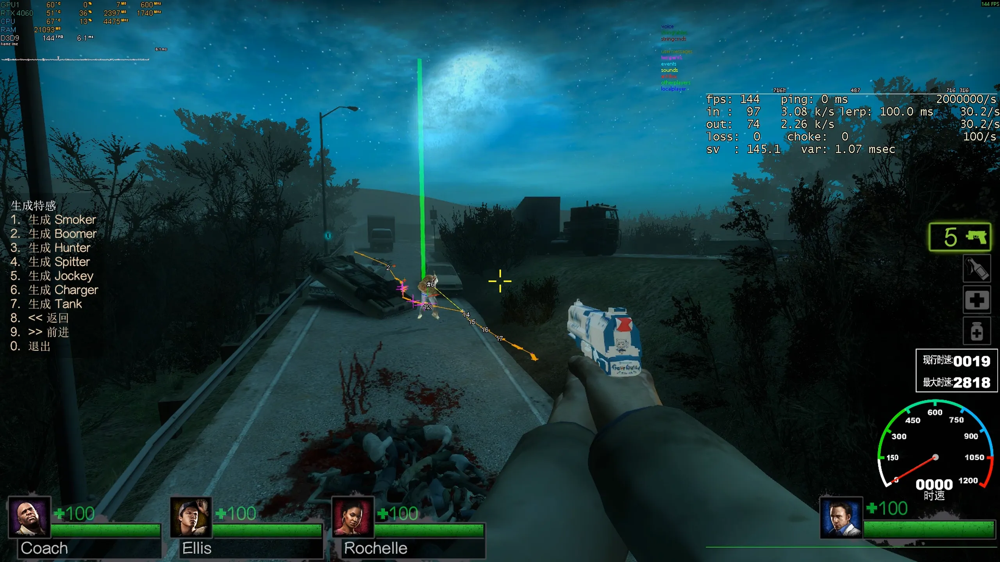
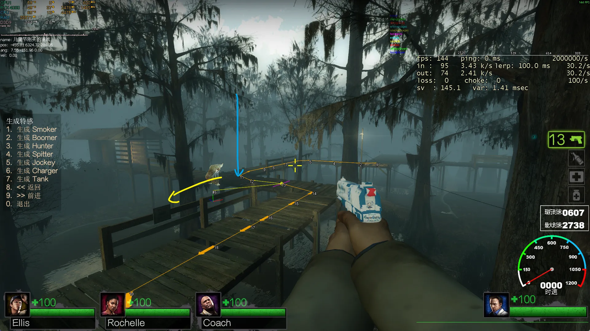
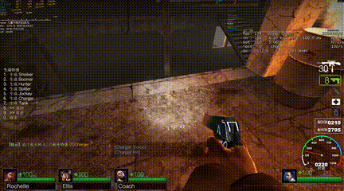
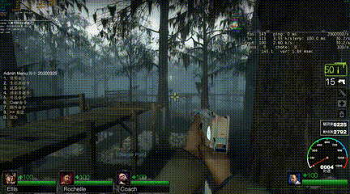

> 此文档应用 Claude Code 基于 Ai Charger 3.0 项目代码生成部分内容，若文档内容有误烦请指出以进行更正😚

## 这是什么

对 Ai Charger 进行增强, 使其更具有攻击性与策略性, 目前增强部分包括但不限于<br>

- Charger 连跳接近目标 (支持连跳时方向左右偏移以规避生还者枪线、连跳时空中速度方向修正)
- 面对近战目标时的博弈行为 (设置近战博弈区 <b>(melee_range + _ai_charger3_melee_bait_minrange, melee_range + _ai_charger3_melee_bait_maxrange)</b>、若与目标距离小于近战危险区 <b>(melee_range + _ai_charger3_melee_bait_minrange)</b> 则向后移动规避伤害)
- 面对持枪目标时的概率冲锋 (设置博弈区, 与目标距离小于 <b>ai_charger3_bhop_min_dist</b> 时进入博弈状态, 停止连跳, 博弈状态下以一定概率发动冲锋)
- 落地时检测更优冲锋目标并立即切换 (无法躲避冲锋的目标优先)
- 阻止 Charger 无技能时逃跑 (强制追击目标生还者)

## Requirements

1. [Left 4 DHooks Direct](https://forums.alliedmods.net/showthread.php?t=321696) (≥ 1.118). Silvers. Left 4 Dhooks 拓展
2. [Actions](https://forums.alliedmods.net/showthread.php?t=336374). BHaType. NextBot 行为树管理拓展
3. [DHooks](https://forums.alliedmods.net/showpost.php?p=2588686&postcount=589). Peace-Maker. 函数动态 Hook 拓展, SourceMod 1.11+ 已内置此拓展

## 使用方式

1. 将 `l4d2_ai_charger3.txt` 放入 `sourcemod/gamedata` 下
2. 将 [logger2.inc](https://github.com/GlowingTree880/L4D2_LittlePlugins/blob/dev/lib/logger2.inc) 和 [treeutil2.inc](https://github.com/GlowingTree880/L4D2_LittlePlugins/blob/dev/lib/treeutil.inc) 放入 `sourcemod/scripting/include` 下
3. 将 `ai_charger3.sp`、`setup.inc`、`stocks.inc` 以及 `state/` 目录放入 `sourcemod/scripting` 下并编译, 将编译过后的 `.smx` 文件放入 `sourcemod/plugins` 下
4. enjoy👍

## 测试环境
```cpp

// 本地服务器

] version
Version 2.2.4.3 (left4dead2)
Network Version 2.1.0.0
Exe build: 14:34:57 Jan 16 2025 (9477) (550)

] meta version
 Metamod:Source Version Information
    Metamod:Source version 1.11.0-dev+1155
    Plugin interface version: 16:14
    SourceHook version: 5:5
    Loaded As: Valve Server Plugin
    Compiled on: May 15 2024 06:37:04
    Built from: https://github.com/alliedmodders/metamod-source/commit/2009298
    Build ID: 1155:2009298
    http://www.metamodsource.net/

] sm version
 SourceMod Version Information:
    SourceMod Version: 1.12.0.7207
    SourcePawn Engine: 1.12.0.7207, jit-x86 (build 1.12.0.7207)
    SourcePawn API: v1 = 5, v2 = 16
    Compiled on: Jun  1 2025 11:09:18
    Built from: https://github.com/alliedmodders/sourcemod/commit/5c407d49
    Build ID: 7207:5c407d49
    http://www.sourcemod.net/

// WSL 虚拟机测试环境 (CentOS 9 Stream)

version
Version 2.2.4.3 (left4dead2)
Network Version 2.1.0.0
Exe build: 22:34:09 Jan 16 2025 (9309) (550)

meta version
 Metamod:Source Version Information
    Metamod:Source version 1.12.0-dev+1219
    Plugin interface version: 16:14
    SourceHook version: 5:5
    Loaded As: Valve Server Plugin
    Compiled on: Feb 22 2025 11:58:30
    Built from: https://github.com/alliedmodders/metamod-source/commit/02ee4a3
    Build ID: 1219:02ee4a3
    http://www.metamodsource.net

sm version
 SourceMod Version Information:
    SourceMod Version: 1.12.0.7210
    SourcePawn Engine: 1.12.0.7210, jit-x86 (build 1.12.0.7210)
    SourcePawn API: v1 = 5, v2 = 16
    Compiled on: Jul  6 2025 09:08:01
    Built from: https://github.com/alliedmodders/sourcemod/commit/0deed714
    Build ID: 7210:0deed714
    http://www.sourcemod.net/

```

## 实现细节

### 状态模式

Ai Charger 3.0 版本相比于 Ai Tank 3.0 与 Ai Smoker 3.0 的特感行为处理上存在区别, Ai Charger 3.0 使用状态模式管理 Charger 的行为, 使其更具拓展性和可维护性

**状态模式 (State Pattern)** 是一种行为设计模式, 其核心思想是: 将对象 (Charger) 在不同状态下的行为封装到独立的状态类 (或结构体) 中, 对象持有一个当前状态的引用, 将行为委托给当前状态对象执行。当内部状态发生改变时, 对象的行为也随之改变

在本插件中, 每个状态 (`ChargerState`) 是一个持有三个函数指针的结构体:
- `OnEnter`: 进入该状态时执行一次
- `OnUpdate`: 每帧由 `OnPlayerRunCmd` 调用
- `OnExit`: 离开该状态时执行一次

状态转换由 `ChargerStateContext.transitionTo(newStateId)` 统一管理, 它会自动调用旧状态的 `OnExit` 和新状态的 `OnEnter`, 保证状态切换的完整性

如果不使用状态模式, 将所有行为逻辑直接写在 `OnPlayerRunCmd` 中, 代码会变成如下形式:

```java
public Action OnPlayerRunCmd(int client, int& buttons, ...) {
    if (dist > bhopMinDist && !isMeleeThreat && ...) {
        // 连跳逻辑 (100+ 行)
        if (isOnGround) {
            if (isWatching && attemptStrafe) {
                // 侧向连跳 (50+ 行)
            } else {
                // 前向连跳 (30+ 行)
            }
            // 检测更好目标 (20+ 行)
        } else {
            // 空中修正 (30+ 行)
        }
    } else if (dist <= bhopMinDist || isMeleeThreat) {
        // 博弈逻辑 (100+ 行)
        if (isMelee) {
            // 近战博弈 (50+ 行)
        } else {
            // 持枪博弈 (50+ 行)
        }
    } else if (shouldCharge) {
        // 冲锋逻辑 (80+ 行)
    }
}
```

这种写法存在以下问题:

| 问题 | 说明 |
|---|---|
| **条件嵌套复杂** | 各阶段行为通过大量 `if/else` 嵌套区分, 逻辑边界模糊, 难以追踪某一时刻 Charger 究竟处于哪个行为阶段 |
| **状态耦合** | 接近逻辑、博弈逻辑、冲锋逻辑混杂在同一函数中, 修改一处极易影响其他行为 |
| **进入/退出逻辑无处安放** | 进入博弈状态时需要重置计时器, 退出接近状态时需要清除急停标记, 这类一次性逻辑在平铺写法中只能用额外的 `bool` 标记模拟, 容易遗漏 |
| **扩展困难** | 新增一个行为阶段需要在已有的条件树中找到合适位置插入, 且必须保证不破坏其他分支 |

使用状态模式后, 每个状态的逻辑完全独立, `OnPlayerRunCmd` 只需一行调用:

```java
public Action OnPlayerRunCmd(int client, int& buttons, ...) {
    // OnPlayerRunCmd 只需调用当前状态的 update 函数即可驱动当前状态工作
    return g_ChargerStateContext[client].update(buttons, vel, angles);
}
```

新增状态只需新建一个 `.inc` 文件并在 `registerStates()` 中注册, 不影响任何现有代码。

### 基于导航路径的连跳

> 🐮🐮 深山苦练 2 个星期, 终于顿悟了连跳的本源...，首先你需要知道...

- `Path` 是 AI 体系的导航系统 (导航路径)，基于 Nav Mesh, 由多个导航路段 (`PathSegment`) 组成, 通过控制台输入 `nb_debug PATH` 命令可以查看当前 NextBot 的导航路径, 每个 `PathSegment` 包含 `goal pos` 目标点坐标与 `forward` 表示该路段 `PathSegment` 的目标点 `goal pos` 到下一路段 `PathSegment` 的目标点的方向向量
- `PathFollower` 是 NextBot 的导航路径跟随器，可以指挥 Bot 沿着当前导航路径移动到一个个目标点以完成寻路目标

年后回完成 Charger 3.0 准备上传到仓库时，在 QQ 群里水群，看到电信服群里提到 Tank 会在 `c2m2` 70% 左右进度的楼梯卡住，大概是类似下图情况，由于 Tank 3.0 插件的连跳逻辑是 <b>Tank 在有目标视野情况使用指向目标位置的方向向量作为连跳加速方向，</b> 黄线为 Tank 的连跳加速方向, 因此目标在楼梯中段时会导致 Tank 连跳到楼梯下方无法接近目标造成 Tank 白给



之后的一天, 在测试 Charger 的防止逃跑功能时使用 `nb_debug` 命令发现了其他选项, 于是每个都试了一下, 发现 `nb_debug PATH` 命令可以查看当前特感到目标的导航路径 (Nav Path)，于是有了想法，能否使用这个路径进行连跳

首先发现 bot 寻路时有一个自身指向每一段导航路段的终点箭头位置的黄色细线，如下图的蓝色箭头位置所示, 于是判断每一段导航路段的终点箭头位置有一个坐标点, 于是截了张图问 Gemini



> 有没有方法能够获取到这条黄色细线指向的终点坐标

Gemini 回复说使用 `DHooks` 去挂钩 `PathFollower::Update` 函数，接着问他怎么知道的，Gemini 继续回答说是根据 [source 2013 sdk](https://github.com/ValveSoftware/source-sdk-2013/blob/master/src/game/server/NextBot/Path/NextBotPathFollow.cpp) 泄露的源码推测的，因为在源码中搜索 `DEBUG PATH` 等字眼发现只存在于 `NextBot` 和 `PathFollower` 等相关文件中，其中 `NextBot` 是游戏 AI 系统相关，`PathFollower` 是 AI 路径跟随相关，在 `NextBotPathFollow.cpp` 的 `PathFollower::Update` 中有一行代码

```cpp
NDebugOverlay::Line( bot->GetEntity()->WorldSpaceCenter(), goalPos, 255, 255, 0, true, 0.1f );
```

对应 IDA 中 `PathFollower::Update` 函数中的

```cpp
// &v99 为 goalPos (v37 + 8) 首地址
NDebugOverlay::Line(v49, &v99, 255, 255, 0, 1, 1036831949);

// 可以看出 v99, v100, v101 分别是从 v37 + 8, v37 + 12, v37 + 16 处取 4 字节数值
v99 = *(float *)(v37 + 8);
v38 = *(float *)(v37 + 12);
v39 = *(float *)(v37 + 16);
v100 = v38;
v101 = v39;

// v37 即为当前路段 PathSegment 结构体指针
v37 = *((_DWORD *)this + 4566);

```

source 2013 sdk 的 [NextBotPath.h](https://github.com/ValveSoftware/source-sdk-2013/blob/master/src/game/server/NextBot/Path/NextBotPath.h) 中定义 Segment 结构体, v37 + 8/12/16 表示跳过 8 字节开始读取 (刚好跳过了 CNavArea 指针的 4 字节, NavTraverseType 枚举类型的 4 字节, 因此是读取目标点 `goal pos`)

```cpp
struct Segment
{
    CNavArea *area;									// the area along the path
    NavTraverseType how;							// how to enter this area from the previous one
    Vector pos;										// our movement goal position at this point in the path
    const CNavLadder *ladder;						// if "how" refers to a ladder, this is it
    
    SegmentType type;								// how to traverse this segment of the path
    Vector forward;									// unit vector along segment
    float length;									// length of this segment
    float distanceFromStart;						// distance of this node from the start of the path
    float curvature;								// how much the path 'curves' at this point in the XY plane (0 = none, 1 = 180 degree doubleback)

    Vector m_portalCenter;							// position of center of 'portal' between previous area and this area
    float m_portalHalfWidth;						// half width of 'portal'
};
```

刚好是从 bot 的 `WorldSpaceCenter` 也就是碰撞箱中心位置 (Charger 腰部) 向 `goal pos` 发射一条 RGB 的黄色 `(255, 255, 0)` 射线，刚好跟描述的相符，第二个参数 `goal pos` 即为所需目标点

接着通过 `DHooks` 挂钩这个函数，在 IDA 中得到目标点坐标相对于 `PathFollower* this` 的偏移量是 `4 * 4566` 字节得到 Charger 当前的导航路段 (`PathSegment`) 结构体, 进而从中读取目标点坐标

但是直接使用当前目标点作为连跳加速方向与空中速度修正方向会出现问题, 比如上图中遇到一些需要拐弯的地方 (图中轿车处, 此时会产生许多较短的 `PathSegment`，因为那里的 Nav Area 相对较小), Charger 若直接使用目标点作为空中速度修正方向的话会在这些拐弯处速度方向被来回修改, 造成视觉上 Charger 在空中被来回推动, 这是不正确的, 因此查阅了 source 2013 sdk 的 NextBotPathFollowe 文件, 查看了 `PathFollower::Update` 函数, 其调用了 `PathFollower::CheckProgress` 函数, `CheckProgress` 函数又进一步调用了 `IsAtGoal` 函数

- `PathFollower::CheckProgress` 函数的主要逻辑是在当前目标点 `goal pos` 距离 bot 位置小于设置的前瞻距离 `m_minLookAheadRange` 的时候，向前检查，跳过前方过于密集的 `PathSegment`，以及检查当前寻路是否结束
  
  1. 首先判断当前的路径段是否有效，且路段类型 `SegmentType` 是否是 `ON_GROUND`， bot 是否在地上，如果以上条件满足，那么接着判断该目标点距离 bot 的距离是否小于前瞻距离，如果小于，就开始向前遍历节点，如果目前目标点距离大于前瞻距离，那么就跳出 while 循环，说明当前的目标点满足要求

  2. 在 while 循环中向前探测下一个节点时，会遇到以下情况，立即跳出循环

       - 下一个节点的路段类型 `SegmentType` 不是 `ON_GROUND`
       - 下一个节点的 z 轴高度大于 bot 当前位置的 z 轴高度加上 bot 最大跳跃高度，那么不可达
       - 下一个节点不满足 `IsPotentialTraversable` 条件或者满足 `HasPotentialGap` 条件表明 bot 位置到该节点不可达或者中间存在大于 bot 最大跳跃高度的落差，那么立即跳出循环
  
  3. 最后判断 bot 当前是否已经抵达目标，如果 bot 已经抵达目标，那么就切换当前的目标节点，如果上面的 `while` 循环中找到了一个有效的节点，那么就使用它（可以跳过中间的一些节点），如果没有那么就用当前 `m_path` 路段数组中的下一个节点
  
  4. 如果当前路段的后继路段 `NextSegment` 是 `null`，表示当前路径走到头了，调用 `OnMoveToSuccess` 函数（bot 需要在地面才能调用 `OnMoveToSuccess` 函数），如果当前路径没有走到头，那么将 bot 的目标点 `m_goal` 设置为下一个路段的目标点，回到 `PathFollower::Update` 中继续 bot 的行动

- `IsAtGoal` 函数主要是用来判断 bot 是否已经到达或越过当前目标点 `goal pos`, 对于路段类型 `SegmentType` 是 `ON_GROUND` 的路段, 首先获取当前 bot 需要到达的目标点 `m_goal` 和其前驱路段节点 `current`, 做 bot 位置到 `m_goal` 位置的向量 `toGoal`

  1. 如果 `current == NULL` 表示当前目标点没有前驱节点，表明 bot 已经走完了整条路径或者路径就一个节点, 直接返回 true

  2. 确定一个分割平面 `dividingPlane` , 若 bot 经过这个平面, 则视为到达目标点: 取当前目标点 `goal pos` 的后继节点 `next = NextSegment(m_goal)`，如果后继节点有效，继续判断 `current` 是否包含梯子，如果包含梯子，那么将 `m_goal` 的 `forward` 方向向量作为 `dividingPlane`，如果不包含梯子，那么执行向量加法 `dividingPlane = current.forward + m_goal.forward`
   
     - 继续判断 `toGoal` 和 `dividingPlane` 的夹角（使用点积来获取夹角），若小于 `0.0001f`，即两个向量夹角大于 90 度，即 bot 已经在 `dividingPlane` 的另一侧，表示已到达，若点积大于 0 则表示 bot 在 `dividingPlane` 的同侧（未到达）

     - 继续判断 `toGoal` 的 z 轴高度是否已经小于 bot 站立的碰撞箱高度 (`StandHullHeight`)
  
     - 继续判断 `toGoal` 的 z 轴高度是否小于一步能到达的高度 `StepHeight` ，且 bot 的到 `m_goal` 的后继节点 `next` 是可达的 (`IsPotentialTraversable`)，且 bot 位置到 `next` 节点的 `goal pos` 连线中间没有向下落差大于 `MaxJumpHeight` 的区域（`!HasPotentialGap`）
  3. 若 a,b,c 都满足，则返回 `true`，表示 bot 已经到达当前目标点 `goal pos`
   
  4. 最后进行兜底判断，如果下一个目标点 `next` 无效或者 a,b 判断不满足出来，那么就判断 bot 与当前目标点的平面距离是否小于 `m_goalTolerance = 25.0f` 若满足，则返回 `true`


由于 `IsAtGoal` 的判断需要高差判断和距离判断，Charger 连跳在空中 (上图所示, 高度大于 `StepHeight`) 时无法进行判断（上图情况，从 Charger 位置到目标节点的连线为 `PathFollower::Update` 的调试输出连线，从 `bot.worldSpaceCenter` 连线到 `m_goal`，Charger 已经飞跃了这整段 `PathSegment`，但是由于在空中无法满足 `IsAtGoal` 的要求，因此 `IsAtGoal` 返回 `false`，导致 `PathFollower::CheckProgress` 中的 `m_goal = nextSegment` 的目标点更新逻辑无法进行，从而导致 Charger 滞空时目标点无法更新）


如上图所示, 下一帧, `OnClientRunCmd` 触发，而因 `PathFollower::Update` 并非每帧触发，而是间隔触发（30tick 下每 3 帧触发一次，也就是 0.1s 一次，图中没有从 Charger 的 `WorldSpaceCenter` 指向 `goal pos` 的黄色细线），Charger 开始执行连跳逻辑（图中为 Charger 已经满足 `OnGround` 条件且在连跳之前可视化 Charger 当前的目标点 `goal pos` 也就是 `m_goal`），而路段 `PathSegment` 12 和 13 相距很短，就算代码中使用`NextSegment(m_goal)` 来作为连跳加速方向，也无济于事，Charger 最后还是会往背后连跳加速



如上图所示, 此时触发了 `PathFollower::Update`，距离上一次 `Update` 的调试输出线消失相隔 3 帧，当前目标点也正确的指向了路段 `PathSegment` 14，但是 Charger 已经起跳并向后加速, 造成走回头路的问题

为了解决这个问题，考虑了几种方法

1. 将 `PathFollower::CheckProgress` 中的地面检测逻辑使用 `Memory Patch` 进行禁用，但是由于 `IsAtGoal` 中也有相关高度检测逻辑，且 `ILocomotion::IsPotentiallyTraversable` 和 `ILocomotion::HasPotentialGap` 等函数都需要近地依赖才能正常工作，因此这个方法较为困难

2. 在 Charger 碰到地面的第一帧首先手动执行 `PathFollower::Update` 让其更新路径，虽然这个方法有一定的可行性，但是可能 Charger 此时的速度很快，而目标点在其前方很近的位置，如果使用目标点作为连跳加速度方向与空中速度修正方向会出现触发空中速度修正时会将 Charger 快速在目标点周围推动的现象

3. 使用目标点到 Charger 的位置向量与 Charger 当前速度方向作点积计算两个向量的夹角，若夹角超过 90 度，则说明目标点在 Charger 背后，然后继续遍历路径剩下的目标点找到一个前向目标点（问题依旧，目标点距离过近），且在下图场景中 Charger 速度如黄线所示，当前目标点如蓝色箭头所示，前向目标点 12，13，14 的位置与 Charger 当前速度方向角度均大于 90 度，且剩下的目标点不可达，因此无法找到一个有效的目标点（蓝色目标点已在 Charger 身后，故不用其作为空中速度修正方向），charger 继续朝前连跳掉下木桥



1. 自己设计一个函数，根据 Charger 此时的速度，从当前目标点开始向前遍历该路径的剩余路段 `PathSegment`，找到一个以 Charger 当前速度一跳可达的最远可见目标点（检测可见避免直角拐弯等场景连跳加速方向撞墙），也就是目前的 `getLookAheadGoalPos` 函数

`getLookAheadGoalPos` 函数用于从 Charger 当前的导航路径中找到一个最优的前瞻目标点，该目标点需要满足以下条件：

1. 以 Charger 当前速度一次连跳可达（距离 ≤ `maxDist`）
2. 从 Charger 位置到目标点之间没有墙体遮挡（使用 `Trace Hull` 进行可见性检测）
3. 高度差不超过 Charger 最大跳跃高度（`JUMP_HEIGHT`）
4. 尽可能远（在满足以上条件的前提下选择最远的节点）

函数分为两个阶段：

**阶段一：使用几何投影法找到有效的起始路段**

由于 Charger 在空中时 `PathFollower::Update` 无法更新目标点（受 `IsAtGoal` 的地面检测限制），可能出现当前目标点 `m_goal` 已经在 Charger 身后的情况。因此需要先向前遍历路径，找到一个真正位于 Charger 前方的起始路段。

设当前路段目标点为 $A$，下一路段目标点为 $B$，Charger 位置为 $P$，定义：

```math
\vec{x} = \overrightarrow{AB} \quad \text{(当前路段方向向量)}
```

```math
\vec{y} = \overrightarrow{AP} \quad \text{(当前目标点指向 Charger 的向量)}
```

计算 $\vec{y}$ 在 $\vec{x}$ 上的投影系数：

```math
t = \frac{\vec{y} \cdot \vec{x}}{|\vec{x}|^2}
```

投影系数 $t$ 的几何意义：

- $t < 0$：Charger 在路段 $AB$ 的起点 $A$ 之前（路段在 Charger 前方）
- $0 \leq t < 0.5$：Charger 在路段前半段（路段仍然有效，使用 $A$ 作为起点）
- $0.5 \leq t < 1.0$：Charger 已经走过路段一半（使用下一路段 $B$ 作为起点），这个判断条件对应 (stocks.inc. L. 861)
- $t \geq 1.0$：Charger 已经越过路段终点 $B$（路段完全在身后，继续检查下一路段）

通过这个投影判断，函数可以快速跳过已经走过的路段，找到一个位于 Charger 前方的有效起始点。

**阶段二：前向搜索最远可达可见节点**

从阶段一找到的起始路段开始，向前遍历路径的后续路段，对每个路段的目标点 $G_i$ 进行以下检测：

1. **可见性检测**：从 Charger 的 `WorldSpaceCenter` 位置 $P$ 向目标点 $G_i$ 发射 `TraceHull`（碰撞箱射线），检测中间是否有墙体遮挡：
   ```cpp
   TR_TraceHullFilterEx(P, G_i + (0, 0, 36), hull_min, hull_max, MASK_PLAYERSOLID)
   ```
   若射线命中墙体，说明直线连跳会撞墙，立即跳出循环，返回上一个可见节点

2. **距离检测**：计算 Charger 到目标点的水平距离 $d$：
   ```math
   d = \sqrt{(G_{i,x} - P_x)^2 + (G_{i,y} - P_y)^2}
   ```
   若 $d \geq maxDist$，说明该节点超出一次连跳可达范围，跳出循环

3. **高度检测**：计算目标点与 Charger 的高度差 $\Delta z$：
   ```math
   \Delta z = G_{i,z} - P_z
   ```
   若 $\Delta z > JUMP\_HEIGHT$，说明一次跳跃无法到达该高度，跳出循环

若以上三个条件均满足，则将该节点记录为 `lastVisPos`（最后一个可见节点），并继续检查下一个路段。遍历结束后返回 `lastVisPos`，即为最优前瞻目标点。

**函数返回值**

- 返回 `true`：成功找到有效的前瞻目标点，结果存储在 `outPos` 中
- 返回 `false`：未找到任何可达可见节点（当前位置到下一个节点之间存在障碍物，不允许连跳）

通过这个函数，Charger 可以在连跳时始终朝向一个合理的前瞻目标点加速，避免因目标点更新延迟或路段过短导致的方向频繁变化问题，使连跳轨迹更加平滑和高效。

现在，Charger 可以⬇️

> map c4m2_sugarmill_a，《斗宗强者》，这个 GIF 还展示了 Charger 需要追逐落后目标点的问题，即 Charger 已经在与生还者同一层的楼上了，目标点仍是楼梯上的一个点，导致卡地形需要触发重新寻路才能继续接近目标



> map c3m1_plankcountry, 可能是因为开始转向朝着目标方向的空中速度方向修正的插值因子设置过小 (0.3)，及 Charger 速度过快导致最后一跳无法准确落在木桥上导致摔落



<hr>

接下来对比几种主流的特感增强 (Hard SI) 插件的连跳策略及个人认为的优劣分析

连跳策略 | 优势 | 劣势 |
-------- | ---- | ---- |
基于特感当前视角的方向向量作为连跳加速方向 | 实现简单，当有目标视野时配合空中速度修正没有问题 | 但是特感的视角方向是一直朝着目标方向的，因而在无视野连跳时若用当前视角方向作为连跳加速方向，若特感与目标中间隔着墙，特感则尝试向墙的方向连跳 |
基于特感当前速度方向作为连跳加速方向 | 可以解决基于视角方向的连跳在无视野时的问题，特感落地可以重新调整速度方向 | 若当前速度过快，且空中速度方向修正方向是朝着目标的，仍然容易卡地形 ?(c4m2 电梯楼楼梯容易飞出楼梯) |
基于到目标的方向向量作为连跳加速方向 | 可视且无障碍时基本和基于视角方向的一样 | 容易卡地形，如 c2m2 滑梯处或一些有高差特感需要绕路的地方 |
基于导航路径 `PATH` 的目标点作为连跳加速方向✅ | 基本解决简单的卡地形问题，只要当前特感的导航路径有效，连跳基本能够到达 | <b>1.</b> 由于 `CheckProgress` 和 `IsAtGoal`的检测逻辑，导致特感有时必须要走到某个滞后的目标点 (比如 c4m2 电梯楼，目标点在 2 楼楼梯上，特感已经通过插件前向计算节点连跳到 4 楼了，仍然需要返回追逐 2 楼的目标点从而满足 `IsAtGoal` 的检测，推进目标点更新)；<b>2.</b> 当生还者位置迅速变化时，特感需要更新导航路径，会出现刚到达 A 路径的第一个目标点，路径立刻切换到 B 路径，又需要重新连跳到 B 路径的第一个目标点，若此时路径再次切换，又需要重新连跳，导致连跳无法加速 |
基于当前身体方向 `ILocomotion::FaceTowards` 方向作为连跳加速方向 (目前还没有测试过) | 因为特感在寻路的时候 `PathFollower::Update` 会调用 `ILocomotion::FaceTowards(goalPos)` 来让 bot 的身体朝向当前目标点，所以理论上和基于 `PATH` 的连跳相差不大 | 还是会因为 `CheckProgress` 和 `IsAtGoal` 的检测逻辑导致追逐滞后的目标点 |
基于路段 `PathSegment` 中的 `forward` 向量作为连跳加速方向 (之前测试过) | 基本能用 | `NextBotPath.cpp` 中是这样构建一个路段的 `forward` 成员的 `Segment *from = &m_path[ i ]; Segment *to = &m_path[ i+1 ]; from->forward = to->pos - from->pos;` 也就是说对于一个路段来说，它的 `forward` 方向向量是其目标点 `goal pos` 指向下一个路段的目标点 `goal pos` 的方向向量，这就导致 Charger 在靠近一个直线路段的目标点时, `forward` 成员实际上指向下一个路段 (可能是斜线路段) 的目标点方向，如果此时使用 `forward` 方向进行连跳，同样可能会卡地形

### 无法规避冲锋的目标选择

对应 `state_approach.inc` 中的 `int getChargeUnavoidableTarget(...)` 函数； Charger 处于 APPROACH、BAIT 状态中且在地面上时, 会扫描周围所有生还者, 判断是否存在比当前目标更近且**无法躲避冲锋**的目标, 判断依据是: 在 Charger 冲锋到达目标所需的时间内, 目标能够横向移出冲锋路径的距离是否足够大

**核心思路**

Charger 以固定速度 $v_c$ (由 Cvar `z_charge_max_speed` 控制) 沿直线冲锋, 目标只能通过**垂直于冲锋方向**的横向移动来躲避, 若目标在冲锋到达前的横向位移小于某个阈值, 则认为目标无法躲避

**推导过程**

设 Charger 与候选目标的水平距离为 $d$, 冲锋速度为 $v_c$, 则冲锋到达时间为:

```math
t = \frac{d}{v_c}
```

在时间 $t$ 内, 目标以当前速度 $\vec{v_t}$ (水平分量) 做匀速运动, 位移向量为:

```math
\vec{s} = \vec{v_t} \cdot t
```

设从 Charger 指向目标的单位方向向量为 $\hat{d}$, 将位移向量 $\vec{s}$ 分解为平行分量 (沿冲锋方向) 和垂直分量 (横向躲避方向):

```math
s_{\parallel} = \vec{s} \cdot \hat{d} \quad \text{(平行分量, 正值表示目标在逃跑)}
```

由勾股定理, 垂直分量 (有效躲避距离) 为:

```math
s_{\perp} = \sqrt{|\vec{s}|^2 - s_{\parallel}^2}
```

若 $s_{\perp} < d_{unavoidable}$ (无法躲避距离阈值), 则认为目标在冲锋时间内无法横向移出冲锋路径, 即**无法躲避**

目标的速度向量 $\vec{s}$ 在垂直于冲锋方向上的投影 $s_{\perp}$ 就是目标能横向移动的最大距离。若这个距离小于阈值, 无论目标往哪个方向跑, 都会被冲锋命中

### 冲锋方向预测

Charger 在发动冲锋前, 不直接瞄准目标当前位置, 而是预测目标在冲锋到达时的位置, 以提高命中率

**核心思路**

对应 `state_charging.inc` 中的 `void calculatePredictedPosition(...)` 函数；将目标的速度向量在水平面上进行**正交分解**: 分解为沿冲锋方向的平行分量 (目标在逃跑或靠近) 和垂直于冲锋方向的横向分量 (目标在侧移), 分别预测两个方向上的位移, 合成最终预测坐标, 垂直于冲锋方向的横向预测位移设有上限以防止目标大幅走位时预测偏差过大

**推导过程**

设 Charger 与目标的水平距离为 $d$, 冲锋速度为 $v_c$, 预测时间为:

```math
t_{pred} = \min\left(\frac{d}{v_c} + 0.25,\ t_{max}\right)
```

其中 $+0.25$ 秒为额外缓冲 (补偿冲锋启动延迟), $t_{max} = 0.5$ 秒为预测时间上限

**建立正交坐标系**

以 Charger 指向目标的水平单位方向向量 $\hat{f}$ 为前向轴 (z 分量置零后归一化):

```math
\hat{f} = \text{normalize}\left(\vec{p}_{target} - \vec{p}_{charger}\right)_{xy}
```

以 $\hat{f}$ 与世界上方向 $\hat{z} = (0, 0, 1)$ 的叉积为横向轴 $\hat{s}$:

```math
\hat{s} = \text{normalize}\left(\hat{f} \times \hat{z}\right)
```

$\hat{f}$ 与 $\hat{s}$ 构成水平面上的正交基, 分别对应冲锋方向和垂直于冲锋方向的横向方向

**速度正交分解**

将目标速度 $\vec{v_t}$ 投影到两个轴上:

```math
v_{\parallel} = \vec{v_t} \cdot \hat{f} \quad \text{(平行分量, 正值表示目标在逃跑, 负值表示目标在靠近)}
```

```math
v_{\perp} = \vec{v_t} \cdot \hat{s} \quad \text{(横向分量, 正负表示目标向左或向右侧移)}
```

**计算预测偏移量**

两个方向上的预测位移分别为:

```math
\Delta_{\parallel} = v_{\parallel} \cdot t_{pred}
```

```math
\Delta_{\perp} = \text{clamp}\left(v_{\perp} \cdot t_{pred},\ -\Delta_{max},\ \Delta_{max}\right)
```

其中 $\Delta_{max} = 45.0$ 为横向预测位移上限

**合成最终预测坐标**

```math
\vec{p}_{pred} = \vec{p}_{target} + \hat{f} \cdot \Delta_{\parallel} + \hat{s} \cdot \Delta_{\perp}
```

展开为分量形式:

```math
\begin{cases}
x_{pred} = x_{target} + \hat{f}_x \cdot \Delta_{\parallel} + \hat{s}_x \cdot \Delta_{\perp} \\
y_{pred} = y_{target} + \hat{f}_y \cdot \Delta_{\parallel} + \hat{s}_y \cdot \Delta_{\perp} \\
z_{pred} = z_{target}
\end{cases}
```

Charger 最终将视角转向 $\vec{p}_{pred}$ 方向后发动冲锋, 使冲锋路径提前指向目标的预测落点

> 若网页无法显示数学公式可以尝试安装浏览器插件: [MathJax Plugin for Github](https://chromewebstore.google.com/detail/mathjax-plugin-for-github/ioemnmodlmafdkllaclgeombjnmnbima/related)

### 目标破绽判定

对应 `stocks.inc` 的 `stock bool isTargetVulnerable(...)` 函数，支持自定义，只需要在里面增加新的判断逻辑即可； Charger 在 BAIT 博弈状态中每帧调用 `isTargetVulnerable` 判断目标是否产生破绽, 一旦返回 `true` 则立即转换为 LOCKED 状态发动冲锋, 函数按优先级依次检查以下条件, 任意一条满足即认为目标存在破绽:

**条件 1 — 目标手中无武器**

目标的 `m_hActiveWeapon` 属性无效, 此时目标无法进行任何攻击或推开, 直接冲锋

**条件 2 — 目标正在换弹**

读取目标当前武器的 `m_bInReload` 属性, 若为 `true` 则目标正处于换弹动作中, 无法攻击或推开 Charger, 直接冲锋

**条件 3 — 目标主攻击处于冷却**

读取目标当前武器的 `m_flNextPrimaryAttack` 属性 (下次允许主攻击的游戏时间), 若满足:

```math
m\_flNextPrimaryAttack > T_{game} + 0.5
```

则目标在未来 0.5 秒内无法开枪或近战攻击, 此时冲锋不会被打断, 直接冲锋

**条件 4 — 目标右键推处于冷却**

读取目标实体的 `m_flNextShoveTime` 属性 (下次允许推开的游戏时间), 若满足:

```math
m\_flNextShoveTime > T_{game} + 0.5
```

则目标在未来 0.5 秒内无法进行右键推, 直接冲锋

**条件 5 — 其他生还者正在注视 Charger**

调用 `isAnySurvivorWatchingCharger(client, target)` 统计除当前目标以外、正在注视 Charger 的生还者数量, 若 ≥ 1 则认为当前 Charger 有被其他生还者集火的风险, 直接冲锋

**条件 6 — 目标持近战武器但 Charger 血量足够**

若目标手持近战武器, 且 Charger 当前血量高于近战对 Charger 的单次伤害值 (`melee_damage_charger`):

```math
HP_{charger} > DMG_{melee}
```

则即使被近战命中, Charger 也不会被一击击倒, 冲锋仍然值得发动

**条件 7 — 博弈超时强制冲锋**

若 Charger 在 BAIT 状态中停留的时间超过 `ai_charger3_bait_max_duration`:

```math
T_{bait} > T_{max\_bait}
```

则无论目标状态如何, 强制认为目标存在破绽并发动冲锋, 防止 Charger 无限博弈

**条件 8 — 目标背后有墙体或高差 (进阶检查)**

调用 `isDirectionBlockedOrFall` 以 Charger 到目标的方向 (冲锋方向) 为基准, 对目标前方 `TARGET_VULNERABLE_ADV_CHECK_DIST` (250 units) 距离进行射线检测:

1. **前方有墙**: 以目标眼睛位置为起点, 沿冲锋方向发射 `TraceHull`, 若命中实体则说明目标前方有墙体, 可以直接携带目标撞到墙体上, 此时可以直接冲锋

2. **前方有高差**: 若前方无墙, 从射线终点向下发射垂直射线检测地面高度:
   - 若向下射线未命中任何实体 (悬空/虚空) → 直接冲锋
   - 若命中地面, 计算目标当前高度与落点高度之差:
     ```math
     \Delta z = z_{target} - z_{ground} > DROP\_DOWN\_THRESHOLD\ (200\ \text{units})
     ```
     高差超过阈值则认为携带目标冲下去即使 Charger 被击杀, 目标的行动仍然可以受到阻碍 (如再次回到冲锋前原来位置需要绕路等), 直接冲锋
   - 若落点实体为 `trigger_hurt` (伤害触发区) → 直接冲锋

若以上 8 个条件均不满足, 则认为目标当前没有破绽, Charger 继续在 BAIT 状态中等待进行概率冲锋

## Charger 状态行为说明

Charger 的行为由四个状态组成, 状态转换图如下:

```
APPROACH (接近) : 若与目标距离达标或进入近战博弈区内 ──> BAIT (博弈)
APPROACH (接近) : 发现更优冲锋目标 ────> LOCKED (锁定)
BAIT     (博弈) : 目标产生破绽     ────> LOCKED (锁定)
LOCKED   (锁定) : 立即 ────────────────> CHARGING (冲锋)
CHARGING (冲锋) : 冲锋结束后 ──────────> APPROACH (接近)
```

### APPROACH — 接近状态

Charger 通过连跳快速接近目标生还者, 是持续时间最长的状态, Charger 生成后首先进入这个状态

**连跳行为:**
- 起跳时每跳施加 `ai_charger3_bhop_impulse` 的加速度, 速度上限由 `ai_charger3_bhop_max_speed` 控制
- 若目标正在看着 Charger (视角夹角小于 `ai_charger3_target_watch_maxdeg`), 连跳方向会在基准方向左右随机偏移 `[ai_charger3_bhop_strafe_mindeg, ai_charger3_bhop_strafe_maxdeg]` 度, 实现 Z 字形规避 (侧向连跳), 开启侧向连跳时若与目标距离小于 `ai_charger3_bhop_strafe_mindist` 时, 禁止侧向连跳以防止 Charger 连跳过头
- 无目标视野时若速度方向与视角方向夹角在 `ai_charger3_bhop_nvis_maxang` 范围内, 仍允许连跳 (寻路连跳)
- 在空中时若速度方向与到目标方向夹角超过 `ai_charger3_airvec_modify_min_deg`, 将速度方向修正为目标方向 (防止连跳过头)

**状态转换条件:**
- 与目标距离 ≤ `ai_charger3_bhop_min_dist` → 转换为 **BAIT**
- 目标持近战武器且距离进入近战博弈区 (`melee_range + ai_charger3_melee_bait_maxrange`) → 空中急停后转换为 **BAIT**
- 落地时发现距离更近且无法躲避冲锋的目标, 且冲锋技能就绪 → 转换为 **LOCKED**

### BAIT — 博弈状态

Charger 在近距离与目标周旋, 等待最佳冲锋时机。

**行为:**
- 面对近战目标: 若与目标距离小于近战危险区范围 (melee_range + _ai_charger3_melee_bait_minrange) 时, 向后移动以规避伤害, 等待目标产生破绽以冲锋
- 面对持枪目标: 每隔 `ai_charger3_prob_charge_chk_dur` 秒以 `ai_charger3_prob_charge_prob` 的概率发动冲锋, 若目标产生破绽则立即冲锋
- 博弈状态持续超过 `ai_charger3_bait_max_duration` 秒后强制转换为 **LOCKED** 锁定状态以进行冲锋, 防止无限博弈

**状态转换条件:**
- 检测到目标漏洞窗口 (近战攻击 CD 时、换弹时、切换武器时、进入右键推 CD 时等) → 转换为 **LOCKED**
- 概率冲锋触发 → 转换为 **LOCKED**
- 博弈超时 → 转换为 **LOCKED**

### LOCKED — 锁定状态

短暂的过渡状态, 确认冲锋目标后立即发动冲锋。

**行为:**
- 若是从 APPROACH 或 BAIT 状态因发现更优目标而转换, 则将 `m_iBetterTarget` 设置为新目标
- 验证目标有效性后立即转换为 **CHARGING**

### CHARGING — 冲锋状态

Charger 发动冲锋并处理冲锋结束后的逻辑。

**行为:**
- 冲锋前对目标位置进行预测 (基于目标当前速度向量的线性预测), 提高命中率
- 冲锋结束后重置所有状态数据, 转换回 **APPROACH** 继续追击

## AI Charger 3.0 对比旧版本的改进

旧版本 Ai Charger 将所有逻辑平铺在 `OnPlayerRunCmd` 中, Ai Charger 3.0 版本在架构和功能上均有大幅改进:

| 对比项 | 旧版本 | 3.0 版本 |
|---|---|---|
| **代码架构** | 所有逻辑平铺在 `OnPlayerRunCmd`, 条件嵌套深 | 状态机架构, 每个状态独立封装, 职责清晰 |
| **博弈行为** | 无博弈逻辑, 接近到一定距离直接冲锋 | 独立 BAIT 状态, 针对近战/持枪目标有不同博弈策略 |
| **连跳** | 仅支持直线连跳 | 支持基于导航路径的连跳以及速度达到一定程度时可进行 S 形侧向连跳规避目标枪线, 角度随机化 (S 型空中速度修正使用余弦函数干预当前速度方向，位于 `state_approach.inc` 的 `executeAirCorrection(...)` 中，可以借助大语言模型辅助理解) |
| **目标切换** | 追击固定目标 | 落地时动态检测更优冲锋目标并切换 |
| **防逃跑** | 无技能时或无法到达目标位置时 (目标在天上，Charger 无法冲锋) Charger 可能逃跑 | `ai_charger3_anti_retreat` 强制追击目标 |
| **可扩展性** | 新增行为需修改主函数 | 新增状态只需新建文件并注册, 零侵入 |

## 代码参考

1. [umlka/l4d2. ai_charger.sp](https://github.com/umlka/l4d2/blob/main/AI_HardSI/ai_charger.sp)
2. [febf0102/L4D1_2-Plugins. AI_HardSI. Ai_Charger.sp](https://github.com/fbef0102/L4D1_2-Plugins/blob/master/AI_HardSI/addons/sourcemod/scripting/AI_HardSI/AI_Charger.sp)
3. breezy/AI_HardSI. AI_Charger.sp
4. Gemini 和 Claude Code 提供基于 PATH 连跳、空中侧向连跳、`getLookAheadGoalPos` 目标点前瞻算法等的部分思路及部分实现代码

## 实用插件

1. [[L4D2] Air Ability Patch](https://forums.alliedmods.net/showthread.php?p=2660278). BHaType. 控制特感是否允许在空中释放技能 (虽然 Ai Charger 3.0 使用线性预测目标的运动轨迹进行冲锋方向预测, 但由于冲锋需要 Charger 在地面时进行, 而 Charger 连跳达到生还者无法规避冲锋距离时很大概率在空中无法冲锋, 待 Charger 落地生还者已拉开一定距离, 因此冲锋方向不一定准确, 如需更高的冲锋命中率建议安装这个插件)
2. [aggressive_specials_patch](https://github.com/umlka/l4d2/tree/main/agressive_specials_patch). umlka. 特感强制攻击生还者补丁
3. [charger_collision_patch](https://forums.alliedmods.net/showthread.php?t=315482&highlight=charger+collision). Lux. 修复 Charger 的冲撞仅能命中每个生还者角色索引的 1 名玩家问题 (2 个 Nick 挨在一起只能撞到一个，第二个 Nick 会裆下 Charger 的冲锋)
4. [Charger Shove Fix](https://forums.alliedmods.net/showthread.php?t=321044). Silvers. 修复 Charger 冲锋时生还者可以通过右键推来令冲锋牛减速的问题
5. [Charger Steering](https://forums.alliedmods.net/showthread.php?t=179034). Silvers. 冲锋拐弯牛插件，好玩
6. [Charger Actions](https://forums.alliedmods.net/showthread.php?t=309321&highlight=charger+collision). Silvers. 允许 Charger 在冲锋时跳跃、非冲锋时右键抓住生还者等好玩的功能

## 现存问题

插件正在给音理测试中，目前存在的主要问题为，若存在其他问题或报错请提交 issues

   1. 主流连跳方式分析中基于导航路径 `PATH` 的连跳的劣势问题导致 Charger 无法有效追击目标，这个方法见仁见智吧，后续会上传普通版本 (使用之前的基于到目标方向作为连跳加速方向) 的 `state_approach.inc` 用于替换连跳方法 (主要替换 `executeGroundBhop` 地面开始连跳和 `executeAirCorrection` 空中速度方向修正函数)
   2. 以及冲锋前目标位置预测算法的不准确，导致部分场景 Charger 就算已经到达了 `lastBhopDist` 理论的冲锋目标无法躲避距离，也仍然不能准确命中目标

## 更新日志

<details>
<summary>2026-03-03</summary>
1. 上传插件<br>
</details>
