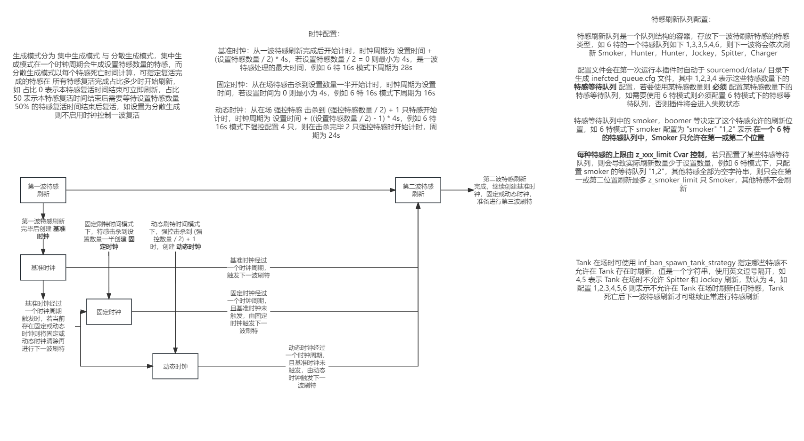

# Infected Control Rework

## 插件介绍
- 本插件为基于原 [Infected Control](https://github.com/GlowingTree880/L4D2_LittlePlugins/tree/main/Infected_Control) 的修改增强版本，后续将会持续维护这一刷特插件，停止维护原 Infected Control 刷特插件
- 插件默认开启控制台输出特感队列生成与其他相关信息，方便调试与维护，如需关闭请修改 Cvar: `inf_enable_logging` 为 `1` 即禁用日志

## Cvars
```java
// 特感刷新数量
inf_limit 6
// 集中刷新时两次刷新的基本间隔 或 分散刷新时每个特感的重生时间
inf_spawn_duration 16
// 特感刷新策略 (1: 每波之间间隔固定 [固定] [击杀特感数量达到设置数量 / 2 开始计时], 2: 每波之间间隔根据击杀情况自动调整 [动态] [击杀特感数量达到设置数量 / 2 或 击杀强控特感数量达到强控总数 / 2 + 1 特时开始计时])
inf_spawn_strategy 2
// 特感刷新方式 (1: 集中刷新 [到时间一起刷新一波, 传统 Anne], 2: 分散刷新 [每个特感单独按 g_hSpawnDuration 计时, 到时间不会一起刷新一波, 类似 Ast])
inf_spawn_method_strategy 1
// 采用分散刷新方式时, 先死亡的特感需要等待至少 [g_hDisperseSpawnPercent * g_hInfectedLimit] 取下整 个特感复活时间完成或在场才允许复活, [如配置 5 特感, 本值为 0.5, 则先死亡的特感需要等待至少 3 只特感复活完成或在场至少 3 只特感才可复活]
inf_disperse_spawn_per 0.5
// 特感找位策略 (1: 轮询所有生还者位置找位, 2: 以随机一个生还者为目标找位)
inf_find_pos_strategy 1
// 每个刷新位置允许刷新多少只特感
inf_each_pos_count 1
// 每局第一波特感刷新在首个生还者离开安全区域后延迟多少秒 (0: 不延迟)
inf_firstwave_delay 0.0
// 有一个生还者倒地则下一波刷特向后延迟多少秒 (0: 不延迟) [仅集中刷新模式可用]
inf_incap_extra_time 5.0
// 多少秒后踢出死亡的特感 [除 Spitter 与 Tank]
inf_dead_kick_time 0.5
// 以何种方式开启特感刷新 (1: 自动控制 [首个生还者离开安全区域自动刷新], 2: 手动控制 [需要输入 !startspawn 指令, 适配 Anne text.smx 插件])
inf_start_spawn_control 1
// 插件日志级别 (1: 禁用, 2: DEBUG, 4: INFO, 8: MESSAGE, 16: SERVER, 32: ERROR) 数字相加, 6 = 2 + 4 表示同时启用 DEBUG 与 INFO 功能
inf_log_level 6

// 特感刷新队列文件位置
inf_queue_kvfile_path data/infected_queue.cfg
// 启用哪种特感的单特感模式 (只会刷新这一种特感, 0: 禁用此功能, [1 - 6] 启用 Smoker, Boomer, Hunter, Spitter, Jockey, Charger 的单特感模式)
inf_single_infected 0
// Tank 在场时禁用哪种特感的刷新 (0: 禁用此功能, 英文逗号隔开, 例 [4,5] 则 Tank 在场时禁用 Spitter 与 Jockey 刷新)
inf_ban_spawn_class_tank 4
// Tank 在场时对禁用刷新特感测策略 (1: 禁止刷新, 2: 替换为可以刷新的其他特感)
inf_ban_spawn_tank_strategy 2
// 超过 6 特以上是否更改刷新队列使得每种类型特感产生一只
inf_over_six_every_class_one 1

// 特感刷新位置距离目标的最小直线距离
inf_pos_min_distance 150
// 特感刷新位置距离目标的最小 Nav 距离
inf_pos_min_nav_distance 100
// 特感刷新位置距离目标的最大直线距离
inf_pos_max_distance 1000
// 特感刷新位置距离目标的最大 Nav 距离
inf_pos_max_nav_distance 1500
// 特感是否允许在安全区域刷新
inf_pos_allow_in_safearea 0
// 特感找位是否需要在目标生还者前方
inf_pos_should_ahead 0
// 找位时网格初始大小
inf_pos_default_grid_min 600
// 找位时网格可拓展的最大大小
inf_pos_default_grid_max 1500
// 从开始找位刷新的时间算起, 超过这个时间 (单位: s) 没有刷新完成一波特感, 开始逐帧进行找位网格拓展
inf_pos_start_expand_time 1.25
// 允许一次找位刷新的最大时间, 超过这个时间 (单位: s) 则暂停 g_hFailedFindPosNextDelay 时间后继续启动找位 (0: 无上限)
inf_pos_find_max_time 8.0
// 一次找位刷新失败找位的暂停时间
inf_pos_fail_delay 2.5
// 逐帧进行找位网格拓展时每帧网格拓展多少单位
inf_pos_expand_unit 3

``````

## Cmds
```java
// 手动开始第一波特感刷新, Cvar: inf_start_spawn_control 为 2 时可用
sm_startspawn (!startspawn) [仅管理可用]
// 更改特感数量
sm_limit (!limit <num>) [仅管理可用]
// 更改特感刷新时间
sm_duration (!duration <sec>) [仅管理可用]
// 启用或禁用单一特感模式
sm_type (!type <num>) [仅管理可用]
// 使用分散刷新模式时, 在控制台输出特感状态数组情况, 调试时使用, 且需要 inf_log_level 等级包含 2 (DEBUG) 时可将结果展示到控制台上
sm_statelist (!statelist)
// 连续测试多次获取特感刷新队列, 如无参数则默认获取 10 次特感刷新队列, 调试时使用, 且需要 inf_log_level 等级包含 2 (DEBUG) 时可将结果展示到控制台上
sm_infqueue (!infqueue <num [10]>)
``````

## 其他图示


## 更新日志
- 2023-08-09: 上传插件与 readme 文件

---
- 如在使用过程中发现任何 Bug，请提出 issue 说明 Bug 类型及发生时情况，如有报错请附上 log 文件信息 (｡･ω･｡)